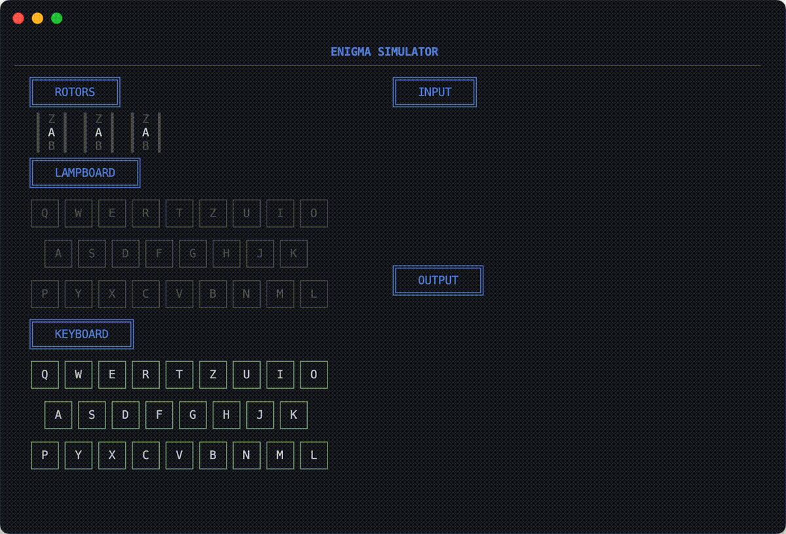

[](https://pkg.go.dev/github.com/lusingander/enigma)


# Enigma

Terminal [Enigma machine](https://en.wikipedia.org/wiki/Enigma_machine) simulator



## Installation

`$ go install github.com/lusingander/enigma/cmd/enigma-simulator@latest`

(require Go 1.18+)

## Usage

### Keybindings

|Key|Description|
|-|-|
|<kbd>A</kbd> - <kbd>Z</kbd>|input|
|<kbd>Ctrl+c</kbd>|quit|
|<kbd>Esc</kbd>|reset|

### Using as a library

```go
import "github.com/lusingander/enigma/enigma"

func main() {
    e := enigma.NewM3(
        [3]enigma.Rotor{
            enigma.NewRotor1('A', 'A'), // (initial position, ring setting)
            enigma.NewRotor2('A', 'A'),
            enigma.NewRotor3('A', 'A'),
        },
        enigma.NewReflectorB(),
        enigma.NewPlugboard(),
    )

    e.EncodeString("HELLO") // returns "MFNCZ"
    e.EncodeString("HELLO") // returns "RHOZF"
}
```

## License

MIT
